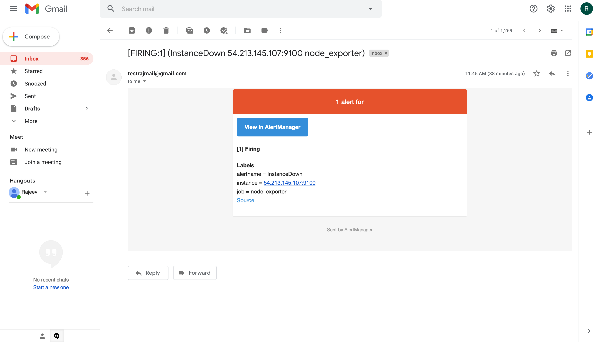
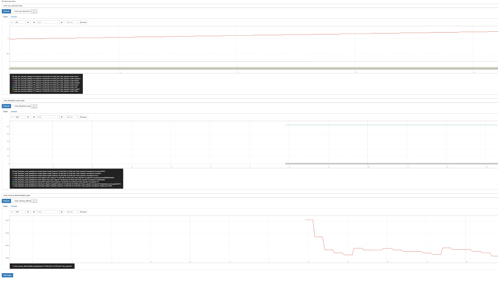

# prometheus-setup
This repo defines steps to install Prometheus, Node Exporter and Alertmanager.
 ## Prometheus
 Prometheus is an open source, metrics-based monitoring system. It has a simple yet powerful data model and a query language that lets you analyse how your applications and infrastructure are performing. It does not try to solve problems outside of the metrics space, leaving those to other more appropriate tools.

 ## Node Exporter
 Node Exporter is a Prometheus exporter for server level and OS level metrics with configurable metric collectors. It helps us in measuring various server resources such as RAM, disk space, and CPU utilization. Node exporter is a good solution to collect all the Linux server related metrics and statistics for monitoring.

 ## Alertmanager
 The Alertmanager handles alerts sent by client applications such as the Prometheus server. It takes care of deduplicating, grouping, and routing them to the correct receiver integration such as email, Slack. It also takes care of silencing and inhibition of alerts.

### Ports
* Prometheus: PORT 9090 
* Node Exporter: PORT 9100 
* Alertmanager: PORT 9093

### Alert to the email

### Graph showing cpu usage and memory 
